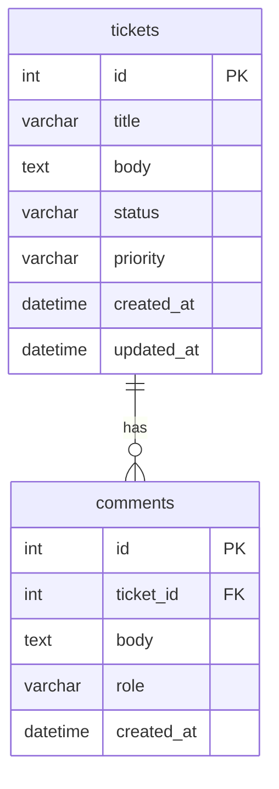

# データベース設計

## お問い合わせ管理アプリ（学習用）

[← 要件定義書に戻る](requirements.md)

---

## 1. ER図

---

## 2. テーブル定義

### 2.1 tickets（チケット）

| フィールド | 型 | 必須 | 説明 |
|-----------|-----|------|------|
| id | number | ✓ | 一意のID（自動採番） |
| title | string | ✓ | お問い合わせのタイトル |
| body | string | ✓ | お問い合わせの本文 |
| status | string | ✓ | ステータス（下記参照） |
| priority | string | ✓ | 優先度（下記参照） |
| createdAt | string | ✓ | 作成日時（ISO 8601） |
| updatedAt | string | ✓ | 更新日時（ISO 8601） |

**status の値**

| 値 | 表示名 | 説明 |
|----|--------|------|
| `open` | 未対応 | 初期状態 |
| `in_progress` | 対応中 | 担当者が対応を開始した状態 |
| `resolved` | 解決済み | 対応が完了した状態 |

**priority の値**

| 値 | 表示名 |
|----|--------|
| `low` | 低 |
| `medium` | 中 |
| `high` | 高 |

---

### 2.2 comments（コメント）

| フィールド | 型 | 必須 | 説明 |
|-----------|-----|------|------|
| id | number | ✓ | 一意のID（自動採番） |
| ticketId | number | ✓ | 対象チケットのID（tickets.id への参照） |
| body | string | ✓ | コメントの本文 |
| role | string | ✓ | 投稿者の役割（下記参照） |
| createdAt | string | ✓ | 作成日時（ISO 8601） |

**role の値**

| 値 | 表示名 | 説明 |
|----|--------|------|
| `user` | ユーザー | お問い合わせした側のコメント |
| `agent` | 担当者 | 対応する側のコメント |

---

## 3. 備考

- 初期実装は json-server を使用するため、フィールド名はキャメルケース（`ticketId`, `createdAt` など）で統一する
- データベースへ移行する際はスネークケース（`ticket_id`, `created_at` など）に変換すること
