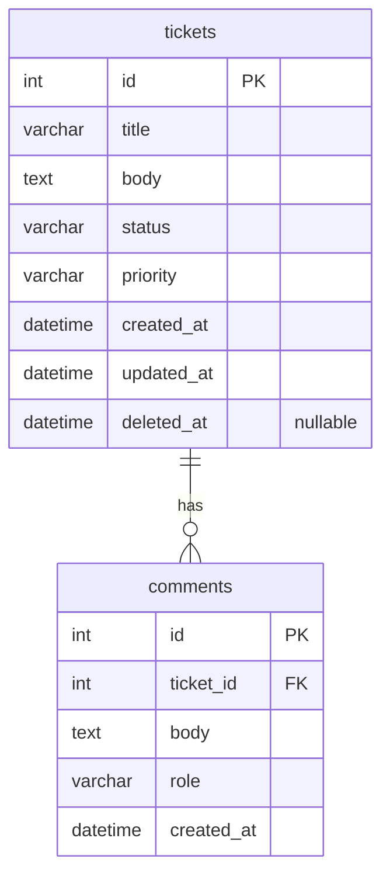

# データベース設計

## お問い合わせ管理アプリ（学習用）

[← 要件定義書に戻る](requirements.md)

---

## 1. ER図

---

## 2. テーブル定義

### 2.1 tickets（チケット）

| フィールド | 型 | 必須 | 説明 |
|-----------|-----|------|------|
| id | bigint | ✓ | 一意のID（自動採番） |
| title | string | ✓ | お問い合わせのタイトル |
| body | text | ✓ | お問い合わせの本文 |
| status | string | ✓ | ステータス（下記参照）デフォルト: `open` |
| priority | string | ✓ | 優先度（下記参照）デフォルト: `medium` |
| created_at | datetime | ✓ | 作成日時 |
| updated_at | datetime | ✓ | 更新日時 |
| deleted_at | datetime | - | ソフトデリートの日時。`NULL` = 有効なチケット（`deleted_at` にはインデックスあり） |

**status の値**

| 値 | 表示名 | 説明 |
|----|--------|------|
| `open` | 未対応 | 初期状態 |
| `in_progress` | 対応中 | 担当者が対応を開始した状態 |
| `resolved` | 解決済み | 対応が完了した状態 |

**priority の値**

| 値 | 表示名 |
|----|--------|
| `low` | 低 |
| `medium` | 中 |
| `high` | 高 |

---

### 2.2 comments（コメント）

| フィールド | 型 | 必須 | 説明 |
|-----------|-----|------|------|
| id | bigint | ✓ | 一意のID（自動採番） |
| ticket_id | bigint | ✓ | 対象チケットのID（tickets.id への外部キー） |
| body | text | ✓ | コメントの本文 |
| role | string | ✓ | 投稿者の役割（下記参照） |
| created_at | datetime | ✓ | 作成日時 |

**role の値**

| 値 | 表示名 | 説明 |
|----|--------|------|
| `user` | ユーザー | お問い合わせした側のコメント |
| `agent` | 担当者 | 対応する側のコメント |

---

## 3. 備考

- フィールド名は Rails の規約に従いスネークケース（`ticket_id`, `created_at` など）で統一する
- comments テーブルに `updated_at` カラムは存在しない（コメントは編集不可）
- tickets の `deleted_at` が `NULL` でないレコードがソフトデリート済みチケット。物理削除は行わない
