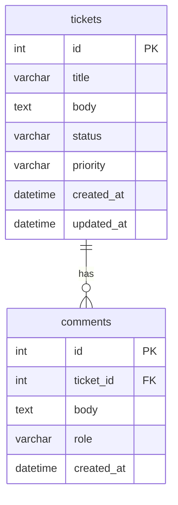
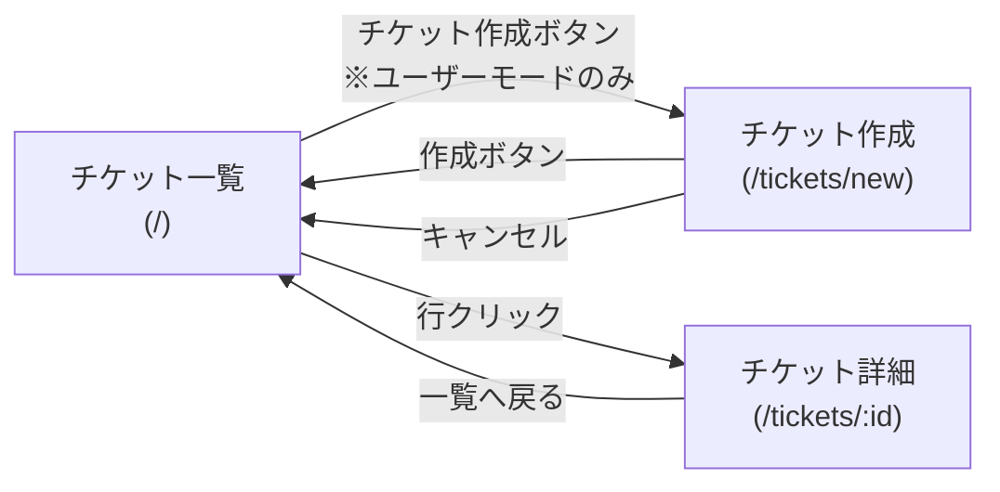

# 要件定義書

## お問い合わせ管理アプリ（学習用）

| 項目 | 内容 |
|------|------|
| 作成日 | 2026-06-02 |
| バージョン | 1.0 |
| 目的 | Zendesk ライクなお問い合わせ管理アプリの学習用実装 |

---

## 1. プロジェクト概要

### 1.1 背景

Zendesk のようなお問い合わせ管理の仕組みを、シンプルな構成で学習目的として実装する。

### 1.2 目標

- チケット（お問い合わせ）の作成・管理・対応ができること
- ユーザーと担当者の2つの役割の違いを画面上で体験できること
- 学習用のため、認証・複雑な権限管理は含まない

---

## 2. ユーザーと役割

本アプリは1名が操作する学習用アプリのため、ログイン機能は持たない。  
画面上のトグルスイッチで役割を切り替えることで、2つの視点を体験する。

| 役割 | 説明 |
|------|------|
| **ユーザー** | お問い合わせを送る側 |
| **担当者** | お問い合わせを受けて対応する側 |

---

## 3. 機能要件

### 3.1 共通機能

| # | 機能 | 説明 |
|---|------|------|
| F-01 | 役割トグル | 画面上部のトグルスイッチで「ユーザー」「担当者」を切り替える |

---

### 3.2 ユーザーモードの機能

| # | 機能 | 説明 |
|---|------|------|
| F-02 | チケット作成 | タイトル・本文・優先度を入力して新規お問い合わせを作成する |
| F-03 | チケット一覧（自分のみ） | 自分が作成したチケットのみを一覧表示する |
| F-04 | チケット詳細表示 | チケットの内容・ステータス・コメント履歴を確認する |
| F-05 | コメント追加 | 自分のチケットにコメント（追記）を投稿する |

---

### 3.3 担当者モードの機能

| # | 機能 | 説明 |
|---|------|------|
| F-06 | チケット一覧（全件） | 全ユーザーのチケットを一覧表示する |
| F-07 | チケット詳細表示 | チケットの内容・ステータス・コメント履歴を確認する |
| F-08 | ステータス変更 | チケットのステータスを変更する |
| F-09 | コメント追加 | チケットに対応コメント（返信）を投稿する |

---

## 4. データ仕様

### 4.1 チケット

| フィールド | 型 | 説明 |
|-----------|-----|------|
| id | number | 一意のID（自動採番） |
| title | string | お問い合わせのタイトル |
| body | string | お問い合わせの本文 |
| status | string | ステータス（下記参照） |
| priority | string | 優先度（下記参照） |
| createdAt | string | 作成日時（ISO 8601） |
| updatedAt | string | 更新日時（ISO 8601） |

**ステータスの種類**

| 値 | 表示名 |
|----|------|
| `open` | 未対応 |
| `in_progress` | 対応中 |
| `resolved` | 解決済み |

**優先度の種類**

| 値 | 表示名 |
|----|------|
| `low` | 低 |
| `medium` | 中 |
| `high` | 高 |

---

### 4.2 コメント

| フィールド | 型 | 説明 |
|-----------|-----|------|
| id | number | 一意のID（自動採番） |
| ticketId | number | 対象チケットのID |
| body | string | コメントの本文 |
| role | string | 投稿者の役割（`user` / `agent`） |
| createdAt | string | 作成日時（ISO 8601） |

---

### 4.3 ER図



---

## 5. 非機能要件

| # | 項目 | 内容 |
|---|------|------|
| NF-01 | データ永続化 | ブラウザを閉じてもデータが消えないこと |
| NF-02 | 単一ユーザー | 認証・セッション管理は不要 |
| NF-03 | シンプルな構成 | 学習目的のため、過度に複雑な設計は避ける |

---

## 6. 画面仕様

### 6.1 画面遷移図



---

### 6.2 チケット一覧画面（`/`）

**ユーザーモード**

```
┌────────────────────────────────────────────────────────┐
│  お問い合わせ管理           [ユーザー ●|○ 担当者]      │
├────────────────────────────────────────────────────────┤
│  [＋ 新規お問い合わせ]                                  │
├──────┬───────────────────┬──────────┬──────┬──────────┤
│  ID  │  タイトル          │ステータス│優先度│  作成日時 │
├──────┼───────────────────┼──────────┼──────┼──────────┤
│   3  │  ログインできない  │  未対応  │  高  │  06-01   │
│   2  │  パスワード変更…  │  対応中  │  中  │  05-30   │
│   1  │  使い方を知りたい  │ 解決済み │  低  │  05-28   │
└──────┴───────────────────┴──────────┴──────┴──────────┘
```

**担当者モード**

```
┌────────────────────────────────────────────────────────┐
│  お問い合わせ管理           [○ ユーザー|担当者 ●]      │
├────────────────────────────────────────────────────────┤
│  （チケット作成ボタンなし）                             │
├──────┬───────────────────┬──────────┬──────┬──────────┤
│  ID  │  タイトル          │ステータス│優先度│  作成日時 │
├──────┼───────────────────┼──────────┼──────┼──────────┤
│   3  │  ログインできない  │  未対応  │  高  │  06-01   │
│   2  │  パスワード変更…  │  対応中  │  中  │  05-30   │
│   1  │  使い方を知りたい  │ 解決済み │  低  │  05-28   │
└──────┴───────────────────┴──────────┴──────┴──────────┘
```

---

### 6.3 チケット作成画面（`/tickets/new`）

```
┌────────────────────────────────────────────────────────┐
│  お問い合わせ管理           [ユーザー ●|○ 担当者]      │
├────────────────────────────────────────────────────────┤
│  新規お問い合わせ                                       │
│                                                        │
│  タイトル                                              │
│  ┌──────────────────────────────────────────────────┐  │
│  │                                                  │  │
│  └──────────────────────────────────────────────────┘  │
│                                                        │
│  本文                                                  │
│  ┌──────────────────────────────────────────────────┐  │
│  │                                                  │  │
│  │                                                  │  │
│  └──────────────────────────────────────────────────┘  │
│                                                        │
│  優先度                                                │
│  ┌────────────┐                                       │
│  │  中    ▼  │                                       │
│  └────────────┘                                       │
│                                                        │
│                     [キャンセル]  [作成する]           │
└────────────────────────────────────────────────────────┘
```

---

### 6.4 チケット詳細画面（`/tickets/:id`）

```
┌────────────────────────────────────────────────────────┐
│  お問い合わせ管理           [ユーザー ●|○ 担当者]      │
├────────────────────────────────────────────────────────┤
│  ← 一覧へ戻る                                         │
│                                                        │
│  ログインできない                    ← タイトル        │
│  優先度: 高                                            │
│  作成: 2026-06-01 10:00  更新: 2026-06-01 12:00       │
│                                                        │
│  ステータス: 未対応               ← ユーザーモード     │
│  ステータス: [未対応        ▼]    ← 担当者モード       │
│                                                        │
│  ログインボタンを押しても画面が                        │
│  切り替わりません。               ← 本文              │
│                                                        │
├────────────────────────────────────────────────────────┤
│  コメント                                              │
│  ┌──────────────────────────────────────────────────┐  │
│  │ ユーザー · 2026-06-01 10:05                      │  │
│  │ ブラウザは Chrome を使用しています。              │  │
│  └──────────────────────────────────────────────────┘  │
│  ┌──────────────────────────────────────────────────┐  │
│  │ 担当者 · 2026-06-01 11:00                        │  │
│  │ ご連絡ありがとうございます。確認いたします。      │  │
│  └──────────────────────────────────────────────────┘  │
│                                                        │
│  コメントを追加                                        │
│  ┌──────────────────────────────────────────────────┐  │
│  │                                                  │  │
│  └──────────────────────────────────────────────────┘  │
│  [投稿する]                                            │
└────────────────────────────────────────────────────────┘
```

---

## 7. 技術スタック

| 役割 | 技術 | 理由 |
|------|------|------|
| フロントエンド | React（Vite） | 学習用途に適したシンプルな構成 |
| データ管理（初期） | json-server | JSONファイルへの永続化、REST APIを自動生成。プロトタイプ段階に使用 |
| データベース（移行予定） | 未定 | json-server からの移行先。SQLite / PostgreSQL / Supabase などを検討 |
| スタイリング | Tailwind CSS | ユーティリティクラスで素早くUIを組め、学習コストが低い |

---

## 8. 対象外（スコープ外）

以下は本アプリでは実装しない。

- ログイン・認証機能
- メール通知
- ファイル添付
- 複数担当者の割り当て
- SLA管理
- 検索・フィルタリング機能
