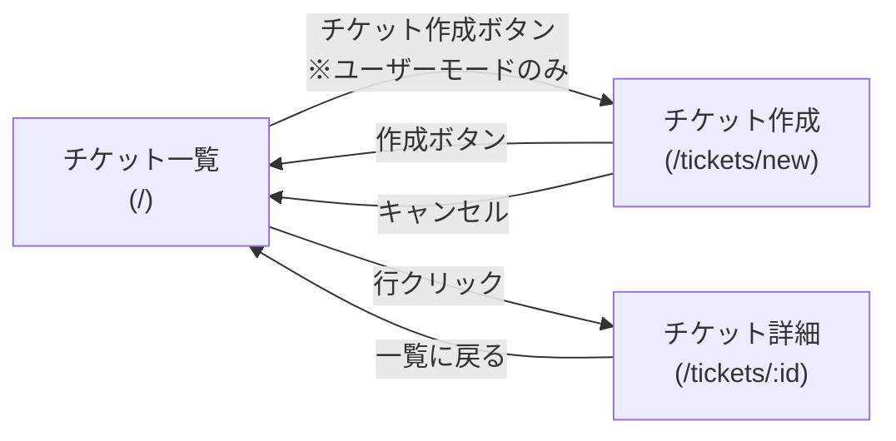

# 画面設計

## お問い合わせ管理アプリ（学習用）

[← 要件定義書に戻る](requirements.md)

---

## 1. 画面一覧

| 画面名 | パス | 説明 |
|--------|------|------|
| チケット一覧 | `/` | チケットの一覧表示 |
| チケット作成 | `/tickets/new` | 新規チケットの作成 |
| チケット詳細 | `/tickets/:id` | チケットの詳細表示・操作 |

---

## 2. 画面遷移図



---

## 3. チケット一覧画面（`/`）

### 3.1 ユーザーモード

```
┌────────────────────────────────────────────────────────┐
│  お問い合わせ管理           [ユーザー ●|○ 担当者]      │
├────────────────────────────────────────────────────────┤
│  [＋ 新規お問い合わせ]                                  │
├──────┬───────────────────┬──────────┬──────┬──────────┤
│  ID  │  タイトル          │ステータス│緊急度│  作成日時 │
├──────┼───────────────────┼──────────┼──────┼──────────┤
│   3  │  ログインできない  │  未対応  │  高  │  06-01   │
│   2  │  パスワード変更…  │  対応中  │  中  │  05-30   │
│   1  │  使い方を知りたい  │ 解決済み │  低  │  05-28   │
└──────┴───────────────────┴──────────┴──────┴──────────┘
```

**画面要件**

| # | 要件 |
|---|------|
| S-01 | 「新規お問い合わせ」ボタンを表示する |
| S-02 | 削除されていないチケットを全件表示する |
| S-03 | 行をクリックするとチケット詳細画面へ遷移する |

### 3.2 担当者モード

```
┌────────────────────────────────────────────────────────┐
│  お問い合わせ管理           [○ ユーザー|担当者 ●]      │
├────────────────────────────────────────────────────────┤
│  （チケット作成ボタンなし）                             │
├──────┬───────────────────┬──────────┬──────┬──────────┤
│  ID  │  タイトル          │ステータス│緊急度│  作成日時 │
├──────┼───────────────────┼──────────┼──────┼──────────┤
│   3  │  ログインできない  │  未対応  │  高  │  06-01   │
│   2  │  パスワード変更…  │  対応中  │  中  │  05-30   │
│   1  │  使い方を知りたい  │ 解決済み │  低  │  05-28   │
│  ~~4~~  │  ~~画面が固まる~~  │ 削除済み │  高  │  05-27   │  ← 薄いスタイル
└──────┴───────────────────┴──────────┴──────┴──────────┘
```

**画面要件**

| # | 要件 |
|---|------|
| S-04 | 「新規お問い合わせ」ボタンは表示しない |
| S-05 | 全ユーザーのチケットを一覧に表示する |
| S-06 | 行をクリックするとチケット詳細画面へ遷移する |
| S-19 | 削除済みチケットを薄いスタイル（タイトル取り消し線・ステータス「削除済み」バッジ）で表示する |

---

## 4. チケット作成画面（`/tickets/new`）

```
┌────────────────────────────────────────────────────────┐
│  お問い合わせ管理           [ユーザー ●|○ 担当者]      │
├────────────────────────────────────────────────────────┤
│  新規お問い合わせ                                       │
│                                                        │
│  タイトル                                              │
│  ┌──────────────────────────────────────────────────┐  │
│  │                                                  │  │
│  └──────────────────────────────────────────────────┘  │
│                                                        │
│  本文                                                  │
│  ┌──────────────────────────────────────────────────┐  │
│  │                                                  │  │
│  │                                                  │  │
│  └──────────────────────────────────────────────────┘  │
│                                                        │
│  緊急度                                                │
│  ┌────────────┐                                       │
│  │  中    ▼  │                                       │
│  └────────────┘                                       │
│                                                        │
│                     [キャンセル]  [作成する]           │
└────────────────────────────────────────────────────────┘
```

**画面要件**

| # | 要件 |
|---|------|
| S-07 | タイトル・本文・緊急度の入力フォームを表示する |
| S-08 | 緊急度の初期値は「中」とする |
| S-09 | 「作成する」ボタン押下でチケットを保存し、一覧画面へ遷移する |
| S-10 | 「キャンセル」ボタン押下で一覧画面へ戻る（保存しない） |

---

## 5. チケット詳細画面（`/tickets/:id`）

### 5.1 通常表示（ユーザーモード）

```
┌────────────────────────────────────────────────────────┐
│  お問い合わせ管理           [ユーザー ●|○ 担当者]      │
├────────────────────────────────────────────────────────┤
│  ← 一覧に戻る                          [削除する]     │
│                                                        │
│  ログインできない                    ← タイトル        │
│  緊急度: [高 ▼]   ステータス: 未対応  ← ユーザーモード │
│  作成: 2026-06-01 10:00  更新: 2026-06-01 12:00       │
│                                                        │
│  ログインボタンを押しても画面が                        │
│  切り替わりません。               ← 本文              │
│                                                        │
├────────────────────────────────────────────────────────┤
│  メッセージ                                            │
│  ┌──────────────────────────────────────────────────┐  │
│  │ ユーザー · 06/01 10:05                           │  │
│  │ ブラウザは Chrome を使用しています。              │  │
│  └──────────────────────────────────────────────────┘  │
│  ┌──────────────────────────────────────────────────┐  │
│  │ 担当者 · 06/01 11:00                             │  │
│  │ ご連絡ありがとうございます。確認いたします。      │  │
│  └──────────────────────────────────────────────────┘  │
│                                                        │
│  ┌──────────────────────────────────────────────────┐  │
│  │                                                  │  │
│  └──────────────────────────────────────────────────┘  │
│  [送信]                                                │
└────────────────────────────────────────────────────────┘
```

### 5.2 担当者モード（ステータス変更可）

```
│  ← 一覧に戻る                                         │
│                                                        │
│  緊急度: [高 ▼]   ステータス: [未対応 ▼]  ← 担当者モード │
│  （未保存の変更がある場合）                             │
│  ┌──────────────────────────────────────────┐         │
│  │ 未保存の変更があります  [元に戻す] [保存] │         │
│  └──────────────────────────────────────────┘         │
```

### 5.3 削除済みチケット表示

```
│  ← 一覧に戻る                                         │
│  ┌──────────────────────────────────────────────────┐  │
│  │  このチケットは削除済みです                       │  │
│  └──────────────────────────────────────────────────┘  │
│                                                        │
│  緊急度: [高 ▼]   ステータス: 未対応  ← ステータスはバッジ表示（変更不可） │
│  （削除ボタン非表示。緊急度変更・メッセージ投稿は引き続き可能）            │
```

**画面要件**

| # | 要件 |
|---|------|
| S-11 | タイトル・本文・緊急度・ステータス・作成日時・更新日時を表示する |
| S-12 | ユーザーモードではステータスをバッジ（テキスト）で表示する（変更不可） |
| S-13 | 担当者モードかつ未削除チケットの場合、ステータスをドロップダウンで表示し変更可能にする |
| S-14 | メッセージを投稿者ラベル・日時付きで時系列順に表示する |
| S-15 | メッセージ入力欄と「送信」ボタンを表示する。送信失敗時はエラーメッセージを入力欄の上に表示する |
| S-16 | 「← 一覧に戻る」ボタンで一覧画面へ戻る（未保存変更がある場合は確認） |
| S-17 | ユーザーモードかつ未削除チケットの場合、「削除する」ボタンを右上に表示する |
| S-18 | 削除済みチケットの場合、削除済みバナーを表示する。ステータス変更ドロップダウンと削除ボタンを非表示にする。緊急度の変更とメッセージ投稿は引き続き可能 |
